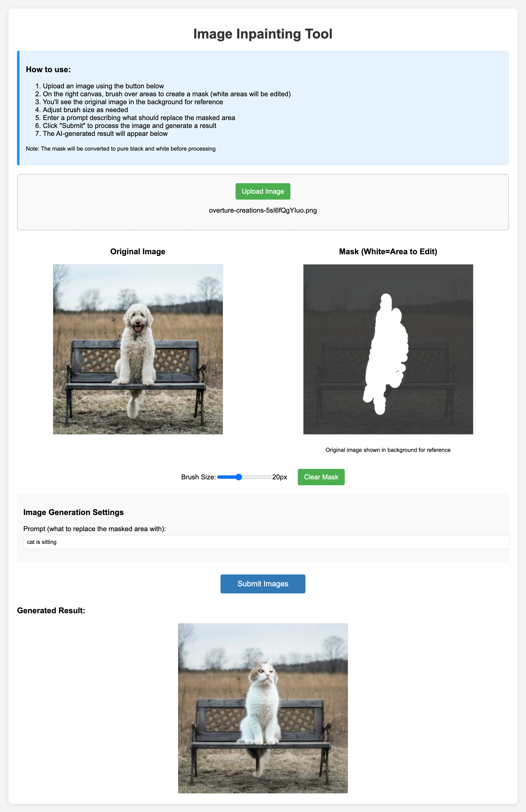

# Stable Diffusion APIの in paint機能検証

Models Labが提供する Stable Diffusion, image to image (in paint) のAPIを検証するための検証コード。

検証として対象画像の選択、対象画像のマスク作成の２つ機能があるページを用意する。対象の画像とフロントで作成されたマスク画像を API に渡し、APIより生成された画像を画面上に表示する。




### 起動方法

https://modelslab.com よりAPIキーを取得し、次のコマンドでサーバーを起動する。

```
API_KEY="<MODELS LAB API>" php -S 127.0.0.1:3000
open http://localhost:3000
```

ブラウザで http://localhost:3000 を開くとスクショの画面が開く。
